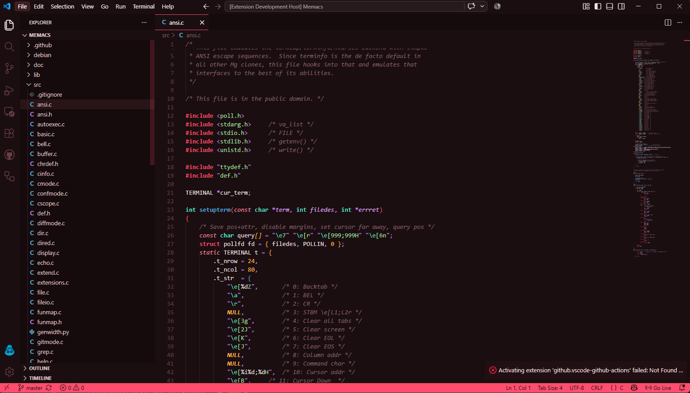
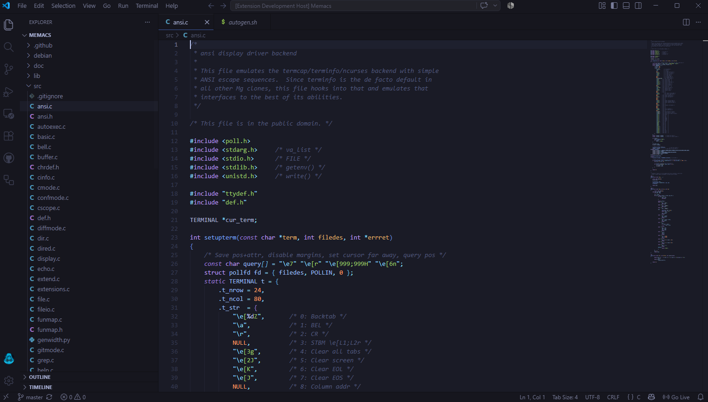
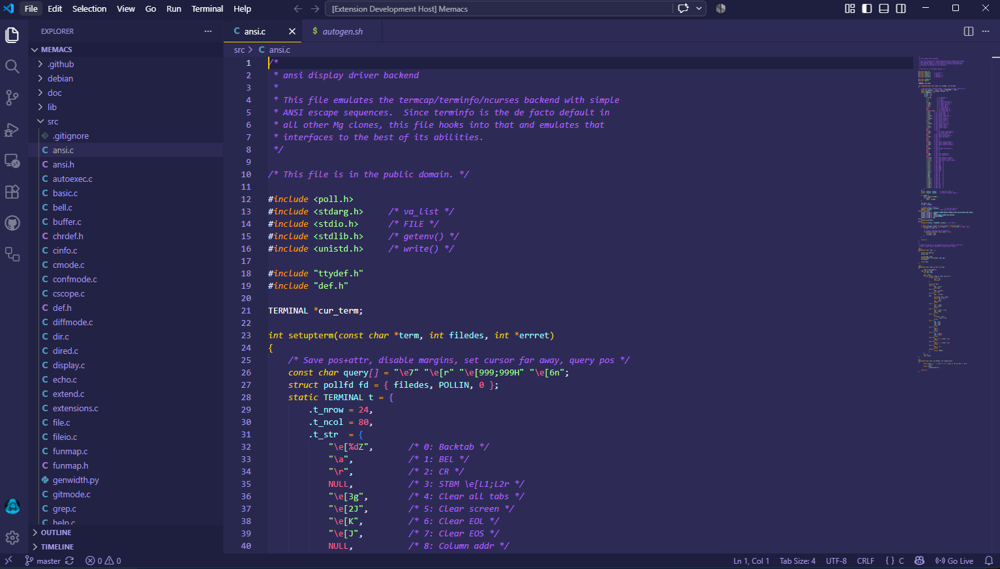
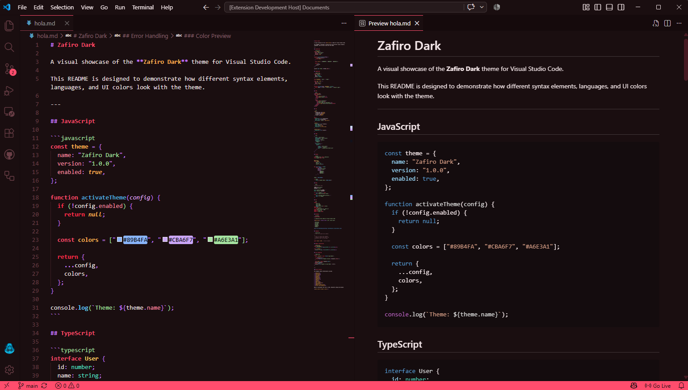
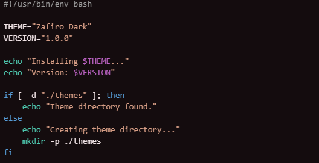
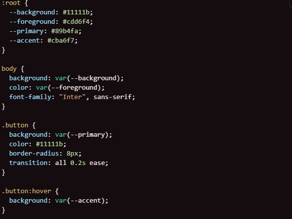
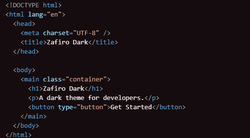

# [Zafiro-Theme](https://marketplace.visualstudio.com/items?itemName=zhuangtongfa.Material-theme)

## [Repositorio de GitHub](https://github.com/IamZynq/Zafiro-theme)

**Idiomas:** 🇪🇸 Español · [🇺🇸 English](../README.md)

Un tema oscuro para Visual Studio Code con un fondo carmesí y una [paleta](https://marketplace.visualstudio.com/search?target=VSCode&category=Themes&sortBy=Installs) de alto contraste para VS Code.

[](https://marketplace.visualstudio.com/search?target=VSCode&category=Themes&sortBy=Installs)
## Donaciones

Si te gusta **Zafiro Theme** y quieres apoyar su desarrollo, puedes hacer una donación mediante **PayPal** o **Criptomonedas**.

### 💙 PayPal

[](TU_ENLACE_DE_PAYPAL)

### ₿ Criptomonedas

[](TU_ENLACE_DE_CRIPTO)

Cada donación es muy apreciada y ayuda a mantener y continuar el desarrollo ❤️

## CAPTURAS DE PANTALLA

### ZafiroDark



### ZafiroPurple



### ZafiroProto



## Estilo de vista previa de Markdown



Recomiendo encarecidamente instalar la extensión **Color Highlight**.

### Configuración recomendada del editor

```json
"editor.fontSize": 20,
"editor.lineHeight": 30,
"editor.fontFamily": "JetBrains Mono",
```

Descarga **JetBrains Mono**: https://www.jetbrains.com/lp/mono

### Ejemplos de colores del código







## Donaciones

Si te gusta esta extensión, puedes hacer una donación para apoyar su desarrollo.

## Usuarios de Python y Pylance

A los usuarios de Python les recomiendo utilizar la extensión [Pylance](https://marketplace.visualstudio.com/items?itemName=ms-python.vscode-pylance), que ofrece un soporte rápido y completo para Python.

La herramienta **Scope Inspector** permite explorar qué tokens semánticos están presentes en un archivo fuente y qué reglas del tema se aplican a ellos.

## Ejemplo de personalización de colores semánticos en `settings.json`

```jsonc
{
  "editor.semanticTokenColorCustomizations": {
    "[One Dark Pro]": {
      // Aplicar únicamente a este tema
      "enabled": true,
      "rules": {
        "magicFunction:python": "#ee0000",
        "function.declaration:python": "#990000",
        "*.decorator:python": "#0000dd",
        "*.typeHint:python": "#5500aa",
        "*.typeHintComment:python": "#aaaaaa",
        "parameter:python": "#aaaaaa"
      }
    }
  }
}
```

Consulta la documentación oficial:

* [Referencia de colores de temas](https://code.visualstudio.com/docs/getstarted/theme-color-reference)
* [Temas de Visual Studio Code](https://code.visualstudio.com/docs/getstarted/themes)
* [Más información sobre la personalización de los colores de sintaxis](https://code.visualstudio.com/updates/v1_15#_user-definable-syntax-highlighting-colors)

## CHANGELOG

[CHANGELOG.MD](https://github.com/IamZynq/Zafiro-theme/blob/main/CHANGELOG.md)

## DOCUMENTACIÓN Y CONTRIBUCIONES

Para ayudar con la documentación, primero haz un fork y clona este repositorio.

Después, accede a la carpeta `ZAFIRO-THEME`:

```bash
cd ZAFIRO-THEME
```
